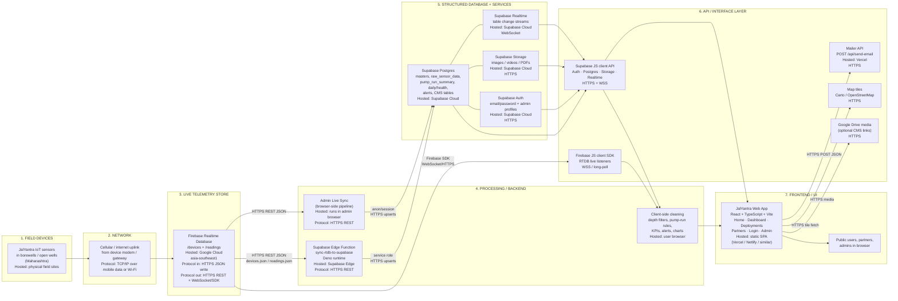

# JalYantra Water Watch — Full Product Analysis

## What this app is (in plain language)

**JalYantra Water Watch** is a groundwater monitoring product for rural India, focused on **Maharashtra**. It watches how deep water sits in agricultural borewells and open wells, and how pumps pull that water out, using small IoT sensors installed in the field.

Think of it as a **“health check for underground water”**: instead of someone visiting a well once in a while with a measuring tape, devices continuously report water depth. The app turns those readings into maps, alerts, trends, and simple stories that farmers, NGOs, panchayats, CSR teams, and researchers can understand.

The product has **three faces**:

1. **A public website** — explains JalYantra, shows real deployments, highlights partners (especially Krushi Vikas), and invites people to start pilots or partnerships.
2. **A live monitoring dashboard** — map of sensors, KPIs, alerts, well-by-well charts, pump run analytics, and CSV export for evidence and reporting.
3. **A private admin console** — for the JalYantra team to update website content, manage devices, sync telemetry, and control what the public sees.

---

## Who it is for

| Audience | What they get |
|----------|----------------|
| **Farmers / village users** | Simple visuals of water depth, stress, and dry-run risk; local language via on-page translation |
| **Field NGOs / partners** (e.g. Krushi Vikas) | Deployment stories, shared monitoring, practical bridge between field knowledge and data |
| **Panchayats / water governance** | District-level view of stress, trends, and critical wells |
| **CSR / research / institutions** | Pilot evidence, certificates/validation storytelling, partnership inquiries |
| **JalYantra operators / admins** | Full CMS, device setup, telemetry sync, and site visibility controls |

---

## The problem it solves (non-technical)

In drought-prone farming areas, groundwater is often managed by **guesswork and rare spot checks**. That leads to:

- Pumps running when water is already too low (**dry-run** risk — can damage pumps and wells)
- No early warning when levels are dropping fast
- Hard to prove impact of conservation or pilot programs
- Partners and funders wanting **visible, shareable evidence** from the field

JalYantra’s answer: put sensors in wells → stream depth live → show “is this well healthy, stressed, or critical?” → estimate how much water pumps are extracting and how many days might be left → alert when something looks unsafe → package the story for communities and partners.

---

## How the system works (layman workflow)

1. **Install** — A JalYantra device goes into a well and starts measuring water depth (and whether the device is online).
2. **Classify** — Admins mark each device as **pump-connected** or **observation-only**, and enter well size details (so the system can estimate volume and extraction).
3. **Stream** — Live readings go into a real-time sensor database.
4. **Sync & calculate** — Those readings are copied into a structured database that computes pump runs, drawdown, daily health colors, remaining water estimates, and alerts.
5. **Monitor** — Anyone with the dashboard can filter by district or well, open charts, and export data.
6. **Tell the story** — Deployments and Partners pages show installations, interviews, galleries, and impact for the outside world.
7. **Operate the site** — Admins turn sections on/off, edit copy and media, and keep the marketing site aligned with the live network.

---

## Screens and what they do

### Home (marketing + impact)

Public landing page for the brand. Typically includes:

- Hero media (images/videos of the field)
- “How it works” style insights
- Live-ish impact numbers from the sensor network
- Dashboard preview (stats, alerts, sample insights like extraction, days of water left, seasonal trends, dry-run alerts)
- Optional deployments preview
- Validation / certificates / testimonials
- Pilot contact form
- Language translation helper

Sections and even whole pages can be switched off from admin without a developer.

### Live Dashboard (core product)

Interactive groundwater operations screen (often marked BETA). Includes:

- **KPI cards** — sensor count, average depth, share of critical districts, fastest-declining district
- **Alerts strip** — rapid decline, critical depth, offline/info; click to jump to the relevant area
- **Map of India (Maharashtra focus)** — sensor pins colored by risk; click a sensor or district
- **Filters** — district / well, live updates toggle, refresh, active sensor count
- **Depth trend chart** — roughly two weeks of multi-well depth lines
- **Well insights table** — health (Healthy / Stressed / Critical), trend, rough “water left” days, device status
- **District side panel** — local stats, trend chart, downloadable report
- **Sensor detail** — current depth/risk; if pump-connected: drawdown chart and run summary; if not: daily median depth over 7 days / 1 month / 3 months
- **History view** — longer history with chart/table and CSV export
- **CSV export** of the dashboard view

### Deployments

Showcase of real field programs (e.g. Alibaug–Raigad style pilots). Each deployment can include:

- Heading, intro, narrative summary
- Interview / overview video
- Installation sites with notes and media
- Photo/video gallery
- Home-page preview media

There is also a **single-deployment deep link** for sharing one program’s story.

### Partners

Partnership and collaboration page:

- Network stats (villages, districts, partner count)
- Featured partner **Krushi Vikas** (about, interview video, photo gallery, engagement points)
- Testimonials
- Partnership inquiry form and contact

### Login + Admin

Email/password login for **admins only**. Non-admins are blocked.

Admin console covers:

- **Visibility & pages** — show/hide home sections; enable/disable public routes
- **Home CMS** — hero, insights, dashboard preview copy, validation, contact/pilot form text
- **Deployments CMS** — create/edit/delete field program stories and media
- **Partners CMS** — featured partner video and gallery
- **Live devices** — per-device settings: well diameter/depth, pump intake, pump vs non-pump, notes
- **Master & telemetry** — browse derived analytics tables; trigger Firebase → database sync; see calculation notes
- **Media upload** — images, videos, PDFs to cloud storage with public URLs

### Not found

Shown for unknown URLs, and also when a page has been disabled in admin config.

---

## Feature catalog (all major capabilities)

### Monitoring & analytics

- Real-time (or near real-time) groundwater depth
- Risk coloring / health states
- District-level aggregation
- Multi-well trend charts
- Pump run detection (start/stop segments)
- Drawdown depth and drawdown rate
- Extraction estimates (liters, using well geometry)
- Remaining volume / days-of-water style estimates
- Daily / weekly / monthly well summaries
- Alert types: low water, dry-run risk, unsafe pump operation, poor recovery, offline/info
- Live vs snapshot refresh modes
- CSV downloads for sharing and offline analysis

### Mapping & exploration

- Interactive map with sensor markers
- District and well filters
- Click-through from alerts → district → sensor detail → history

### Device intelligence

- Distinction between **pump wells** (drawdown during runs) and **non-pump / observation wells** (daily median depth)
- Online/offline awareness
- Admin-editable physical well parameters that change analytics quality

### Public storytelling

- CMS-driven home, deployments, partners
- Google Drive–friendly media + zoomable images
- Certificates / validation storytelling (e.g. digital water summit style recognition)
- Offline fallback content if deployments fail to load

### Engagement

- Pilot interest form (home)
- Partnership inquiry form (partners)
- Email notifications to the team via a small mailer service
- Google Translate for local-language access

### Operations

- Admin-only auth
- Page/section feature flags
- Media library
- Telemetry sync pipeline (scheduled edge job and/or manual live sync from admin)

---

## Technical stack

| Layer | Technology |
|-------|------------|
| Frontend app | React 18, TypeScript, Vite |
| Routing | React Router |
| Styling / UI | Tailwind CSS, shadcn/ui (Radix primitives), Lucide icons, Framer Motion |
| Charts | Recharts |
| Maps | Leaflet (react-leaflet) |
| Client data cache | TanStack React Query |
| Forms / validation | React Hook Form, Zod |
| Live sensor stream | Firebase Realtime Database |
| Backend platform | Supabase — Auth, Postgres, Storage, Realtime-capable tables, Edge Functions (Deno) |
| Email | Separate Node Express + Nodemailer service (deployable on Vercel) |
| Testing | Vitest, Testing Library, jsdom |
| Tooling | ESLint, PostCSS, Autoprefixer |
| Deploy shape | Static frontend build to Netlify / Vercel / similar; backend on Supabase; mailer as its own small service |

### Data architecture (conceptually)

Sensors write live depth into Firebase → sync copies into Supabase → derived tables for pump runs, daily health, alerts, district summaries → dashboard reads live Firebase (and/or structured tables) while the marketing site and admin CMS read Supabase content/auth/storage.

---

## Roles & access (simple)

- **Public visitor** — home, dashboard, deployments, partners (unless a page is disabled)
- **Admin** — must log in and be marked as admin; gets the full CMS + device + telemetry console
- There is no multi-role farmer/operator portal in the current design — it’s basically **public + admin**

---

## Business / non-technical value

- **For communities:** earlier warning before wells go dry or pumps run empty; clearer sense of “how stressed is our water?”
- **For partners like Krushi Vikas:** a shared digital window into villages they already work with; better site selection and farmer conversations backed by data
- **For JalYantra as a company:** a credible pilot showcase (map + stories + certificates) that converts interest into partnerships via contact forms
- **For operators:** one place to run the website and the sensor network without needing engineers for everyday content changes
- **Geographic focus:** rural Maharashtra pilots across multiple districts and villages, with the story framed around agricultural groundwater resilience

---

## Bottom line

JalYantra Water Watch is an **IoT groundwater intelligence product wrapped in a partner-facing website**. Sensors watch wells and pumps; the dashboard turns that into maps, health scores, pump drawdown, and alerts; the marketing and admin layers turn field work into a living story that communities, NGOs, and institutions can trust and act on.


JalYantra Website — Complete Extracted History

I reviewed the provided history and filtered out Project Zul, Climate Crusaders, Blue Terrain, and unrelated discussions. Below is only the material related to JalYantra / Jal Jantra / Jaliantra / Jaljandru. The meeting summaries use several spellings, but they clearly refer to the same water-monitoring platform.

Note: I distinguish between things the records say were implemented/completed and things that were decided/requested/planned. I’m not treating every action item as completed.

Timeline
Date	JalYantra discussion / problem	Solution, implementation or decision
Jan 30, 2026	Initial planning for a new JalYantra IoT dashboard website. Required live sensor locations/data, insights, alerts, graphs, maps and downloadable data.	Decided to build the website from scratch, connect it to Firebase Realtime Database (RTDB), use Leaflet + OpenStreetMap for sensor mapping, and support sensor-data export/CSV downloads. Existing IoT dashboard code/prototype was also to be shared as a starting reference.
Feb 14, 2026	Website had reached a working live-preview stage. Remaining issues included popup overlays, table scrolling and production deployment.	Records explicitly state that all pending website updates had been completed and a latest live preview was shared. For production, Hostinger vs GoDaddy + Vercel was discussed. UI fixes agreed: stop legend/monitor boxes overlapping popups, fix hidden table readings, and separate Graph / Table into two tabs.
Feb 28, 2026	Requirement changed toward making JalYantra publicly accessible and useful to NGOs. Login was a barrier; NGOs also needed raw sensor data.	Agreed to temporarily disable login while preserving authentication code for possible future use. Planned APIs for NGOs, potentially deployed through Vercel, returning XML or another required format. Also planned a new public homepage containing ICCW certification, impact metrics, photos, testimonials, project benefits and dynamic statistics, plus regional-language support.
Mar 5, 2026	Dashboard needed a scalable content structure because some project content/data would only become available later.	Designed around collapsible/hidden sections for introduction, device details, deployment photos, insights, certificates and feedback. Chose a static sensor-map image for this presentation area instead of an interactive map. Planned image carousel, Upanra branding, project description and deployment/device images.
Mar 5, 2026	Needed a way for villages/organizations to contact JalYantra about deployments.	Added/planned “Run a Pilot with Us” inquiry flow connected to the project support email. Email/app-password or hosting access was required for the integration.
Mar 5, 2026	Dashboard needed regional accessibility.	Decided on a language dropdown, English by default, initially including Hindi and Marathi, with expansion to other Indian languages through Google Translate. Frequent intermediate reviews were also agreed to prevent rework.
Apr 7, 2026	Real pump-monitoring data exposed calculation and graph problems. Example: depth moved from 3.36m to 3.44m = 0.08m, while max drawdown was showing 0.10m. Graphs also became confusing across multiple pump runs.	Decided to review/correct max drawdown and average drawdown calculations. Pump-run visualization would separately connect start-depth and end-depth points. The Y-axis was considered for reversal so increasing physical depth would make visual sense. Device 05 was preferred for analysis because its data appeared more reliable.
Apr 7, 2026	Needed deeper analysis of Firebase sensor data.	Firebase data for the Nagpur 05 device was accessed and exported to CSV for analysis/manipulation. The team reviewed pump start/stop timing, depth measurements, overlapping lines and last-24-hour data.
May 12, 2026	Deployment information was becoming too large for the homepage. Needed a scalable way to manage deployment content and future chapters.	Decided on a separate Deployment page. Homepage would contain a lighter preview with one installation video, four photos and “Learn More”, linking to the detailed page. Deployment page would support intro, summary, installation videos, field notes and a 6–9 image gallery.
May 12, 2026	Project owners needed to update content without developer intervention.	Admin-panel scope expanded to manage hero text, images, cards, graphs, deployment media, map image, alerts and chapter-specific content. It was also requested to support four graphs instead of the existing two.
May 12, 2026	Community/chapter information needed scalable organization.	Decided on collapsible chapter/community sections, with each chapter supporting its own videos, images, introduction and one or more chapter leads. Awards/certificates would appear as small clickable images opening a larger popup.
May 28, 2026	Competition submission created a 15-day deadline. Homepage, deployments, partner content, map and data structure needed upgrades.	Requested an Impact Matrix with four cards, an Actionable Insights section, corrected navigation, a new Partner page, improved contact form, and dashboard repositioning for visibility. Deployment sections would become collapsible/tabs.
May 28, 2026	Existing real-time sensor data did not contain all one-time physical installation attributes needed for calculations.	Decided to add master/device fields including well depth, well/pump-related dimensions and pump intake level, with Supabase tables used for master-data management.
May 28, 2026	Map and device-detail UX needed refinement.	Map would be constrained to India level. “Device in focus” would be replaced by a well/district overview table, non-functional date selector removed, and pump visualization standardized to green = pump start, red = pump stop.
Jun 9, 2026	Homepage content was too hard-coded, preventing non-developers from changing headings, metrics and insights.	Decision: make impact metrics, actionable insights, headings, text and numbers editable through the admin panel rather than fixed in code. The shorter deployment preview that had accidentally been removed from the homepage was also to be restored.
Jun 9, 2026	Dashboard map legend and graphs were confusing/inaccurate. Some depth values were clearly incorrect, including a cited 95m value.	Map legend changed away from pump start/stop toward safe / moderate / warning depth status. Depth graph Y-axis would be corrected and support approximately 2–20m. Data sources/calculations were to be checked for erroneous depth values.
Jun 9, 2026	Historical graph ranges needed standardization.	Decided to expose 1 week, 1 month and 3 month timeline views with clear date ranges. Pump drawdown visualization retained green start / red stop logic.
Jun 9, 2026	Firebase alone made calculated/aggregated data management difficult. Needed better visibility into raw data, calculations, KPIs and alerts.	Architecture direction became Firebase → processing → Supabase. A separate AWS EC2 instance was proposed for data processing between Firebase and Supabase. Supabase would hold structured/master/calculated information based on a new table schema.
Jun 16, 2026	Major issue discovered: 3 of 4 devices were not pump-connected. Showing pump-drawdown charts for those devices produced misleading output. Some records also lacked synchronized timestamps.	Implement a pump/non-pump flag at device level. Code should ignore entries without valid timestamps. Pump-connected and non-pump-connected devices would use different visualization logic.
Jun 16, 2026	Non-pump devices have relatively static water levels and cannot meaningfully use a 24-hour pump-drawdown visualization.	For non-pump devices, calculate/display daily median depth, plot a smooth trend for 7 days / 1 month / 3 months, and remove 24-hour pump drawdown. History for these devices should contain a raw-data table without graphs.
Jun 16, 2026	Admin-panel uploads for certificates/images/graphs were not reliably replacing existing files on the live website.	Planned fix for the static endpoint/file replacement issue. Certificate/endorsement placeholders would be removed/hidden and the section made dynamic for future additions. Pump/non-pump management would also be exposed through the admin panel.
Aug 5, 2026	Detailed validation of Supabase tables found timestamp, mapping and calculation errors.	Decided to standardize timestamps to IST, resolve duplicate/conflicting device mappings, remove duplicate device 07 in favor of 7, and verify data flow for devices 06 and 09.
Aug 5, 2026	Pump extraction calculation was wrong because code multiplied by 100 instead of 1000 when converting volume to liters. Daily summaries also disagreed with pump-run summaries.	Correct pump extraction per run, pump runtime, pump-run count and daily extraction calculations. Physical values such as well depth and diameter must come from master tables, not hard-coded constants.
Aug 5, 2026	Needed consistent groundwater volume and trend calculations.	Calculation methodology clarified around cylindrical well volume: use π × r² × depth × 1,000 for liters. Seven-day depth change should use correct period readings; negative depth change represents water-level recovery. Daily summaries should use median readings where specified.
Aug 5, 2026	Future JalYantra version may use battery-powered mobile survey devices across many villages, meaning a device may no longer be permanently tied to one well.	Architecture direction changed toward mapping measurements by well ID rather than device ID, preparing the platform for mobile survey data collection.
Aug 8, 2026	Critical admin issue: editing master data was undone whenever Firebase data was fetched. Location/device/master tables were resetting.	Root cause identified as hard-coded values and redundant logic in Supabase Edge Functions/admin code. Decision: only raw sensor data should refresh from Firebase; master tables must remain untouched and be manually maintained.
Aug 8, 2026	Dashboard was still relying too heavily on Firebase even though calculated data was being built in Supabase.	Started transition toward using Supabase as the source for calculated dashboard values. First pilot was to switch one UI table to Supabase for values such as 30-day water drawn, health and trend.
Aug 8, 2026	Needed meaningful groundwater alerts and more useful location information.	Alert system to use daily_median_water_depth_meters from Supabase for low-water conditions. Well popup would display village and taluka from location master instead of latitude/longitude, and include the alert message directly.
Aug 8, 2026	Architecture and calculation logic needed formal documentation for competition submission and handover.	Shivam was tasked with documenting backend logic, architecture, data normalization, pump-run identification, recovery calculations and issue-resolution process.
JalYantra's Technical Evolution

The project essentially progressed through these stages:

1. Jan — Initial architecture

IoT Sensors → Firebase RTDB → JalYantra Website

Website built from scratch with Firebase, mapping, sensor visualization, graphs, alerts and exports.

2. Feb–Mar — Public platform + homepage

Authentication became optional/public-facing, while the authentication code was preserved. The project expanded beyond a pure dashboard into a complete public website with certification, impact information, deployment photos, testimonials, multilingual support and NGO APIs.

3. Apr — Real-data validation

Real pump data exposed problems in drawdown calculations and graph design. Firebase exports and actual pump runs began being used to validate the calculations.

4. May — CMS/admin + deployment architecture

JalYantra evolved into a multi-page platform with:

Homepage → Dashboard → Deployments → Partners → Contact

and an admin panel controlling content, deployments, maps, alerts, graphs and other dynamic information.

5. Jun — Data architecture became more sophisticated

The limitations of directly displaying Firebase data became clear. The architecture moved toward:

Firebase raw sensor data → processing/calculations → Supabase structured/calculated data → JalYantra UI

AWS EC2 was discussed as the processing layer between Firebase and Supabase.

6. Jun — Pump vs non-pump logic

The system was redesigned to understand two device types:

Pump-connected: pump runs, start/stop depth, drawdown and recovery.

Non-pump-connected: daily median groundwater depth and longer-term 7-day/1-month/3-month trends.

Invalid/non-synchronized timestamp records were to be excluded.

7. Aug — Master data + calculation correction

The team moved physical attributes such as well dimensions into master tables instead of hard-coding them. Extraction calculations, daily summaries, timestamps and device/well mappings were systematically validated.

8. Aug 8 — Firebase/Supabase responsibility clearly separated

The latest architecture direction in the supplied history is:

Firebase
→ raw sensor readings only

Supabase
→ location master
→ well/device master
→ pump-run summaries
→ daily well summaries
→ calculated KPIs
→ water-level alerts
→ health/trend values

JalYantra UI
→ consume raw/live information where appropriate, but increasingly use Supabase calculated data for dashboard insights.

Most importantly, refreshing Firebase data should never overwrite Supabase master tables.

Key Solutions Implemented / Designed

The history therefore shows these major JalYantra solutions:

Firebase RTDB for IoT raw/live sensor data.
Leaflet + OpenStreetMap originally planned for interactive sensor mapping.
CSV/data export for sensor analysis.
Public dashboard with login temporarily disabled while preserving authentication code.
NGO APIs, with Vercel discussed for deployment.
Regional-language support through Google Translate.
“Run a Pilot with Us” inquiry workflow.
Collapsible/dynamic website sections.
Separate Deployment and Partner pages.
Admin panel for content and master-data management.
Supabase for master, structured and calculated data.
Proposed AWS EC2 processing layer between Firebase and Supabase.
Device-level pump/non-pump flag.
Timestamp validation and exclusion of unsynchronized records.
Pump start/stop and drawdown visualization.
Daily-median groundwater trends for non-pump devices.
7-day, 1-month and 3-month historical views.
Master-table-driven well depth/diameter instead of hard-coded physical values.
Corrected water-volume/extraction calculations.
Low-water alerts based on daily_median_water_depth_meters.
Village/taluka display from location master.
Separation of Firebase raw-data refresh from persistent Supabase master tables.
Migration of calculated UI values from Firebase toward Supabase.
Future architecture designed around well ID instead of device ID to support portable/mobile survey devices.

The history runs from the initial Jan 30 architecture discussion through the Aug 8 Firebase/Supabase restructuring, showing JalYantra evolving from a relatively simple Firebase-connected IoT dashboard into a full groundwater-monitoring data platform with public website, admin CMS, deployment management, master data, calculated analytics, alerts, APIs and separate raw/processed data layers.

---

# Competition Q&A — Data validation, error handling, debugging & incident log

## 1. What data-validation, error-handling and debugging logic exists?

### Data validation (sensor / groundwater path)

JalYantra cleans and validates readings in layers before they reach charts and alerts:

| Check | Rule (current system) |
|-------|------------------------|
| Required coordinates | A reading must have finite depth + latitude + longitude; otherwise it is discarded for the dashboard map/list. |
| Unsynced device clock | If the device reports clock not synced, or timestamps look like `UNSYNCED` / `uptime:…`, those samples are **dropped** on the dashboard path (they are not trusted for trends). |
| Timestamp quality | Prefer full date-time (assumed IST / Asia/Kolkata when timezone missing). Bare date-only values are not trusted for charts. Invalid timestamps are ignored; without any valid time, history is emptied and the sensor is treated as offline. |
| Depth sanitization | Non-numeric / NaN depth → treated as 0; otherwise rounded to 0.01 m. |
| Plausible depth range (dashboard) | Keep depths in **0–60 m**. Out-of-range points are filtered from history when any plausible points exist, and a validation flag is recorded. |
| Plausible depth range (sync into structured DB) | Skip depths that are NaN, ≤ 0, or **> 100 m** (slightly wider gate than the UI). |
| Sudden jump / anomaly flag | Depth change ≥ **1.5 m within 5 minutes** is flagged as abnormal for operators — **not auto-deleted** (flagged for review). |
| Device merge | Multiple live paths for the same device ID are merged so one well does not appear twice. |
| Pump-run validation | A pump run only counts if: samples form a session (gap ≤ **20 minutes**, or same power-on session), ≥ 2 points, total drawdown ≥ **2 cm (0.02 m)**, and duration > 0. Recovery / flat noise is excluded. |
| Chart noise reduction | Moving average (3–5 samples) and display rounding (~0.04 m); trailing flat plateau trimmed so charts don’t invent a line to “now”. |
| Duplicate raw readings | Database unique constraint on **(device, timestamp)**; sync ignores duplicates. |
| Duplicate pump runs | Unique constraint on **(well, pump start, pump stop)** so re-sync does not create duplicate run rows. |
| Active vs offline | If latest reading is older than ~30 days (demo threshold), status shows offline. |
| Master physical data | Well depth, diameter, pump intake, pump vs non-pump come from admin-maintained master records (not invented from live stream). |

### Error handling

- Dashboard Firebase / structured-DB fetch failures: catch errors, log to console, **keep last good data** on screen (fail soft).
- Empty live reading payload while Live mode is on: **do not wipe** the UI — keep previous sensors.
- Structured-DB bootstrap empty or failing: log and continue; live Firebase can still populate.
- Admin sync / CMS / uploads: user-facing toast messages for success and failure.
- Deployments page: if content cannot load, show a **static offline fallback** sample so the page still works.
- Auth: non-admins are signed out; protected admin area shows Access Denied.
- Contact / email service: missing fields → 400; send failure → 500 + generic form error for the user.
- CSV export: if there are no rows, warn in console and skip download.
- **No React error boundaries** and **no automatic network retries** — operators refresh or toggle Live manually.

### Debugging logic

- Validation flags attached per sensor (filtered out-of-range counts, ignored unsynced timestamps, sudden-jump messages).
- Admin “Master & Telemetry” area to inspect raw and calculated tables and re-run sync.
- Unit tests for pump-run rules (only sessions with real drawdown count).
- Console logging at key failure points (see logs section below).
- Manual CSV export of sensor history for offline spreadsheet validation (used repeatedly during field QA).

---

## 2. How are missing, duplicate, delayed, invalid or out-of-range readings handled?

| Condition | How JalYantra handles it |
|-----------|---------------------------|
| **Missing coordinates** | Reading / device not shown on map (or dropped in bootstrap if location invalid). |
| **Missing / invalid timestamp** | Dashboard: drop sample; if none remain → empty history + offline. Sync path: may fall back to numeric key or (weaker) current time — known residual risk. |
| **Unsynced clock** | Dashboard: drop. Sync: attempt alternate timestamp; otherwise may stamp “now” (stricter cleaning is on the UI path). |
| **Out-of-range depth** | Dashboard filters outside 0–60 m (with flag). Sync skips ≤0 or >100 m. |
| **NaN / garbage depth** | Sync skips; UI sanitizes. |
| **Duplicates** | Raw unique (device + time); pump-run unique (well + start + stop); merge same device ID in UI. |
| **Delayed / late packets** | Rolling 24h/48h windows are anchored on the **latest sample**, not wall-clock “now”, so analysis follows the device’s last known time. There is **no hard max-delay reject** beyond unsynced/invalid timestamp rules. |
| **Sudden spikes** | Flagged in validation messages; still visible for human review (not silently deleted). |
| **Recovery mistaken as pumping** | Min 2 cm drawdown + 20-minute session gap / power-on session split. |
| **Non-pump wells** | Do not use pump-drawdown charts; use daily median depth over 7 days / 1 month / 3 months instead. |

Honest gap for competition judges: dashboard cleaning is stricter than sync-into-DB cleaning; spike anomalies are flagged but not auto-removed; delayed data has no separate “late arrival” quarantine beyond timestamp validity.

---

## 3. What happens during connectivity failure?

1. **Live sensor database unreachable** — Dashboard keeps the last successfully loaded sensors (or earlier structured bootstrap). Loading stops. Errors go to the browser console. There is no prominent “sensor network offline” banner yet.
2. **Live subscription returns empty readings** — UI intentionally does **not** clear existing markers/tables.
3. **Structured database (CMS / calculated tables) down** — Marketing/admin may fail specific loads; Deployments fall back to sample content; dashboard still attempts live stream.
4. **Admin sync fetch fails** — Treated as empty result; sync may complete with zero devices/readings and report counts.
5. **Mailer / contact API down** — Form shows a generic error; no offline queue.
6. **Auth / profile check fails** — User signed out with an admin-privileges error message.

Overall strategy: **fail soft, preserve last-known monitoring view, rely on manual refresh**.

---

## 4. Where are system / backend logs?

JalYantra does **not** currently use a dedicated observability product (no Sentry / Datadog / centralized log shipper in this codebase). Logs live where each runtime writes console output:

| Layer | Where logs appear |
|-------|-------------------|
| Browser / dashboard | Developer console — Firebase fetch errors, realtime subscription errors, structured bootstrap failures, CSV empty warnings, 404 path logs, contact form errors |
| Admin / CMS | Browser console + on-screen toasts; storage upload start/success/error logs |
| Sync edge function | Supabase Edge Function / Deno logs (`Syncing RTDB…`, 500 JSON `{ error }`) |
| Email service | Server / Vercel function logs (`[Mailer] sendEmail error`) |
| Database integrity | Postgres unique constraints reject duplicates (constraint errors surface in sync/admin responses) |

For day-to-day debugging, the team uses: browser DevTools, Admin telemetry tables, Supabase function logs, and CSV exports of device history.

---

## 5. Main software / data-cleaning / validation / abnormal-data / calibration problems to date

For competition: problems encountered, root cause, fix, and how the fix was verified.

### Problem 1 — Max / average drawdown did not match real pump runs (Apr 2026)

- **Symptom:** Example depth 3.36 m → 3.44 m (= 0.08 m), but max drawdown showed ~0.10 m; multi-run graphs overlapped and confused operators.
- **Cause:** Drawdown aggregation and chart connection logic did not cleanly isolate each pump session; noisy / recovery segments mixed in.
- **Fix:** Recalculate max/avg drawdown per run; connect start→end per session; later formalized pump-session rules (20-min gap, ≥2 cm drawdown, duration > 0), chart smoothing and plateau trim.
- **Verified:** Manual Firebase CSV analysis for preferred reliable device (e.g. device 05); unit tests that only verified-drawdown sessions count.

### Problem 2 — Extreme / impossible depths (e.g. ~95 m) on graphs (Jun 2026)

- **Symptom:** Depth charts and legend showed physically implausible values for shallow agricultural wells.
- **Cause:** Bad samples passed through without a plausible-range filter; Y-axis / legend oriented around pump start/stop instead of depth risk.
- **Fix:** Dashboard plausible range **0–60 m** with validation flags; sync skips >100 m; map legend moved to safe / moderate / warning / critical depth bands; Y-axis corrected for ~2–20 m typical view.
- **Verified:** Visual QA on dashboard after filter; residual note that 60–100 m can still enter structured sync but is filtered on the stricter UI transform.

### Problem 3 — Pump-drawdown charts on non-pump wells (Jun 2026)

- **Symptom:** 3 of 4 devices were not pump-connected; static water levels produced misleading “pump run” visuals. Some records lacked synchronized timestamps.
- **Cause:** One visualization path assumed every device was a pumping well; unsynced timestamps were still plotted.
- **Fix:** Device-level **pump vs non-pump** flag in master data. Pump wells → drawdown / run summary. Non-pump → daily median depth for 7d / 1m / 3m. Drop invalid/unsynced timestamps on dashboard path.
- **Verified:** Field classification of devices; UI shows different detail views per type; history for non-pump emphasizes table/median trend.

### Problem 4 — Timezone mismatch (India field data vs browser) (fixed in codebase)

- **Symptom:** Chart labels and day boundaries shifted depending on the viewer’s laptop timezone.
- **Cause:** Timestamps displayed in local browser TZ instead of field IST.
- **Fix:** Standardize display/parsing around **Asia/Kolkata**; assume +05:30 when timezone missing.
- **Verified:** Commit “Fix timezone handling: Asia/Kolkata”; charts/labels reviewed against known IST pump windows.

### Problem 5 — Fake pump runtime (+10 minutes per sample) 

- **Symptom:** Daily/runtime totals inflated vs real pumping time.
- **Cause:** Code added a fixed +10 minutes per pumping step instead of real elapsed time between timestamps.
- **Fix:** Use actual timestamp deltas (and later aggregate from real pump-run summary rows).
- **Verified:** Commit “Fix pump runtime calculation to use real elapsed time”; cross-check against pump-run summary durations.

### Problem 6 — Fabricated daily pump aggregates when no runs detected

- **Symptom:** Daily summaries showed pump counts / runtime / drop even when no valid pump runs existed.
- **Cause:** Fallback logic invented stats from sample counts.
- **Fix:** Daily summary reads only from real **pump_run_summary** rows — explicitly **no fabrication**.
- **Verified:** Commit “use real pump_run_summary data instead of fabricated daily aggregates”; unit tests align with drawdown-only session counting.

### Problem 7 — Incorrect zero-clamp on remaining water

- **Symptom:** Remaining water / depth metrics looked wrong when median depth exceeded configured well depth.
- **Cause:** `max(0, wellDepth − medianDepth)` hid negative / over-depth situations instead of surfacing calibration issues.
- **Fix:** Remove incorrect zero-clamp; allow negative remaining depth signal; estimate days from 7-day average extraction or null when unknown.
- **Verified:** Commit “Fix Daily Well Summary: remove incorrect zero-clamp”; review against master well depth.

### Problem 8 — Extraction volume off by 10× (×100 vs ×1000)

- **Symptom:** Liters extracted disagreed with physical expectation and between daily vs per-run summaries.
- **Cause:** Volume→liters used ×100 instead of ×1000; some physical constants were hard-coded.
- **Fix:** Cylinder formula π × r² × Δh × **1000** for liters; well diameter/depth from **master tables**.
- **Verified:** Aug 2025/2026 calculation review; comparison of pump-run vs daily extraction after correction.

### Problem 9 — Duplicate pump-run rows on re-sync

- **Symptom:** Re-running Firebase→structured sync duplicated the same pump events.
- **Cause:** Insert without idempotent identity.
- **Fix:** Unique constraint on (well, start, stop); deterministic upsert identity for runs in the edge sync path.
- **Verified:** Migration description (“prevent duplicate pump run rows when sync is re-run”); re-sync no longer multiplies identical runs.

### Problem 10 — Duplicate / conflicting device IDs (e.g. “07” vs “7”)

- **Symptom:** Conflicting mappings, duplicate device rows, broken joins into summaries.
- **Cause:** Inconsistent serial/ID formatting across Firebase and masters.
- **Fix:** Manual master cleanup (prefer canonical ID); UI merge-by-deviceId; numeric-aware sorting.
- **Verified:** Aug validation of devices (including 06 / 09 flow checks) after cleanup.

### Problem 11 — Firebase refresh overwrote curated master data (Aug 2026)

- **Symptom:** Editing well depth/diameter/location in admin was undone after sync.
- **Cause:** Sync upsert replaced location / well / device masters with hard-coded or live defaults.
- **Fix:** Policy: **only raw sensor data refreshes from Firebase**; master tables are manually maintained. Admin sync uses ignore-duplicates / preserve existing well dimensions where implemented.
- **Verified:** Re-edit master fields, re-sync, confirm masters persist; architecture note documented for competition handover. (Edge path still needs ongoing care so defaults cannot silently overwrite.)

### Problem 12 — Calibration / missing installation attributes

- **Symptom:** Extraction, remaining volume, and dry-run buffer wrong because live stream lacked well geometry.
- **Cause:** One-time physical installation attributes (well depth, diameter, pump intake) were not in the live feed.
- **Fix:** Admin-editable device/well master fields; calculations read masters instead of magic constants.
- **Verified:** After entering real geometry, extraction and remaining-water numbers re-checked against cylinder math and field notes.

### Problem 13 — Overlay / map UI bugs (supporting data trust)

- **Symptom:** Legend/monitor boxes overlapped popups; table readings hard to see — operators mistrusted the live view.
- **Cause:** Z-index / layout collisions.
- **Fix:** Overlay stacking and Graph/Table separation fixes.
- **Verified:** Live preview QA after UI commits.

---

## Competition-ready one-paragraph summary

JalYantra validates groundwater IoT data by rejecting unsynced clocks and invalid coordinates, sanitizing depths, filtering out-of-range values (0–60 m on the dashboard; skip >100 m on sync), flagging sudden jumps, merging duplicate device identities, and counting pump runs only when a real ≥2 cm drawdown session is detected. Duplicates are blocked by database unique keys. On connectivity failure the dashboard fails soft and keeps last-known data; CMS pages can fall back to offline sample content. Logs are console-based across browser, Supabase edge functions, and the mailer service. Real field data exposed drawdown math errors, extreme depths, non-pump misclassification, timezone skew, fabricated aggregates, wrong liter conversion, master overwrite, and ID collisions — each corrected with calculation fixes, master data, constraints, and verified via CSV field analysis, unit tests, re-sync checks, and dashboard QA.

---

# Competition — Complete JalYantra Architecture

## End-to-end flow (one diagram)



## Same architecture as a hosting + protocol table

| Stage | Component | What it does | Where hosted | Protocol / interface |
|-------|-----------|--------------|--------------|----------------------|
| 1. Device | JalYantra IoT water-depth sensors | Measure groundwater depth / device online state in wells | Physical wells (Maharashtra field sites) | Device modem/gateway → internet |
| 2. Network | Cellular / Wi‑Fi uplink | Carries sensor payloads to the cloud | Mobile network / local internet | TCP/IP (typically cellular data) |
| 3. Live database | Firebase Realtime Database (`/devices`, `/readings`) | Stores raw live telemetry & device registry | Google Firebase — **asia-southeast1** | Devices write JSON over **HTTPS**; readers use **HTTPS REST** (`.json`) and/or **Firebase SDK (WebSocket / HTTPS)** |
| 4a. Processing | Supabase Edge Function `sync-rtdb-to-supabase` | Pull last telemetry window, validate, detect pump runs, compute daily/health/district/alert tables | **Supabase Edge (Deno)** | **HTTPS REST** fetch from Firebase; **HTTPS** writes to Postgres |
| 4b. Processing | Admin “Fetch & Populate” Live Sync | Operator-triggered sync + calculations from Admin UI | Runs in **admin’s browser**, writes to cloud DB | **HTTPS REST** to Firebase + **HTTPS** to Supabase |
| 4c. Processing | Dashboard client logic | Depth cleaning, pump vs non-pump charts, KPIs, alerts, CSV | **User browser** | In-memory processing after API/SDK data arrives |
| 5. Structured DB | Supabase Postgres | Masters, raw rows, pump-run summaries, daily/weekly metrics, alerts, CMS content | **Supabase Cloud** (project Postgres) | SQL via PostgREST (**HTTPS**) |
| 5. Auth | Supabase Auth + admin profiles | Login; only admins reach Admin console | **Supabase Cloud** | **HTTPS** |
| 5. Files | Supabase Storage | CMS media (images, videos, PDFs) | **Supabase Cloud** | **HTTPS** upload/download |
| 5. Streams | Supabase Realtime | Optional live table updates for admin/CMS | **Supabase Cloud** | **WebSocket (WSS)** |
| 6. API layer | Supabase JS client | Unified app interface to Auth/DB/Storage/Realtime | Called from SPA | **HTTPS + WSS** |
| 6. API layer | Firebase JS client | Live dashboard readings/devices | Called from SPA | **WSS / HTTPS** |
| 6. API layer | Mailer service | Pilot / partnership contact emails | **Vercel** serverless | **HTTPS POST** JSON |
| 6. External | Map tiles + Drive | Basemap imagery; optional Drive video/image embeds | CartoCDN / OSM; Google Drive | **HTTPS** |
| 7. Frontend | JalYantra Water Watch SPA | Public site + live dashboard + admin CMS | Static hosting (**Vercel / Netlify / similar**) | Browser **HTTPS** to all backends |

## Responsibility split (competition talking point)

```text
FIELD SENSORS
      │  (cellular / internet)
      ▼
FIREBASE RTDB  ──────────────►  LIVE DASHBOARD (direct)
  raw /devices + /readings         Firebase SDK (live)
      │
      │  HTTPS REST sync
      ▼
PROCESSING (Edge Function + Admin Sync + browser rules)
  validate · pump runs · daily health · alerts · volumes
      │
      ▼
SUPABASE POSTGRES + AUTH + STORAGE
  masters · calculated tables · CMS · media
      │
      ▼
JALYANTRA WEB UI
  Home · Dashboard · Deployments · Partners · Admin
      │
      ├──► Vercel Mailer (contact forms)
      └──► Map tiles / Drive media
```

**Key rule:** Firebase holds **raw live telemetry**. Supabase holds **master data + calculated analytics + website CMS**. Sync must refresh raw/calculated paths without wiping curated master well geometry.